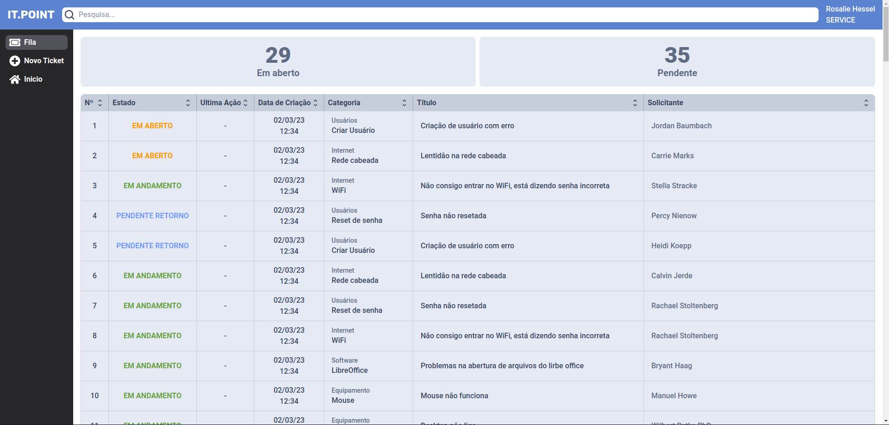
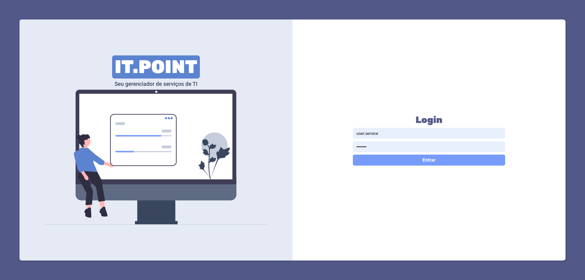
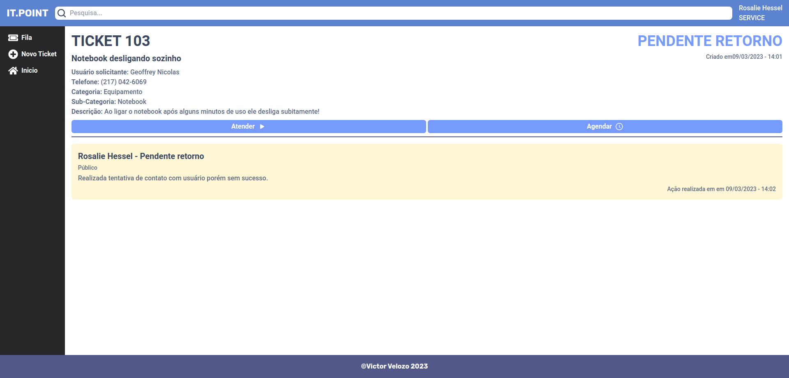

<h1 align="center">IT.POINT - Front-end</h1>

<h3 align="center">
A simple ITSM (IT service manager) system made with Next.JS
</h3>

## About

IT.POINT is an ITSM (i.t. service manager) tool system, basically, a way for its users to communicate through tickets with the IT staff, for service desk help. But it can also be used for field service.

This project was created to learn about Next.JS routing and server-side rendering, React JS complex components, API fetch and requests, JsonWebToken Authentication and more!

\*_THIS PROJECT REQUIRES THE IT.POINT BACKEND DOCKER CONTAINER RUNNING, CHECK IT OUT [HERE](https://github.com/VrituuRuby/it.point-backend)_

## Installation

Project created with create-next-app.

To run it you will need [Docker](https://www.docker.com) and [Docker Compose](https://docs.docker.com/compose/) to run the database and backend.

Clone this and the backend repository and then

1. Install dependencies with `npm install` or `yarn` in the terminal
2. Run it with `npm` or `yarn dev`

or

Simply run it with `docker compose up -d` in your terminal to start it in the background

## Usage

With the backend running and seeded database go to `http://localhost:3000` and you can login with these:

- Admin
  - user: admin
  - password: admin
- Service user
  - user: user.service
  - password: service
- Normal user:
  - user: user.user
  - password: user

## Functionalities and Features

- Any user can create new tickets
- Service role users get a list of all not closed or concluded tickets
- When creating new tickets automatically fills in selected user data
- Admin role users can create new categories and subcategories for tickets if necessary
- Users can add notes to existing tickets to inform anything
- Adding notes can change the ticket status between "open", "pending", "in progress" or "closed"

## Technologies

- Next.js
- Axios
- Eslint
- TypeScript
- TailwindCSS

## Contributors

- [Peterson Adami Candido](https://github.com/wetrustinprize) - Helped with dockerfile and docker compose networking

## Links

- [Figma](https://www.figma.com/file/YIvEiIjdQ6ouEXwQvw4Ago/IT.POINT?node-id=0%3A1&t=DqliVzRN80IePwJv-1)
- [IT.POINT - Back end](https://github.com/VrituuRuby/it.point-backend)
