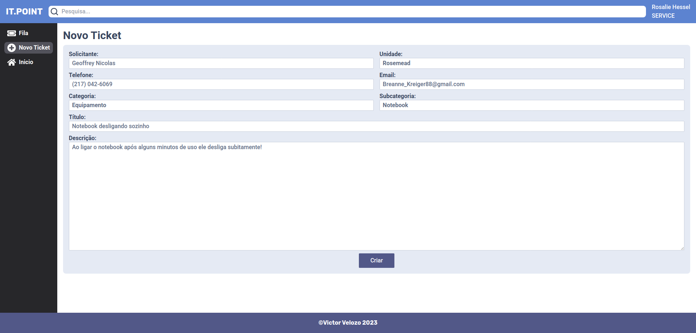

<h1 align="center">IT.POINT - Front-end</h1>

<h3 align="center">
A simple ITSM (IT service manager) system.
</h3>

## About

IT.POINT is an ITSM (i.t. service manager) tool system, basically, a way for its users to communicate through tickets with the IT staff, for service desk help. But it can also be used for field service.

## Functionalities and Features

- The users with the role of "service" get a list of all not closed or concluded tickets
- Normal users and service users can create new tickets
- When creating new tickets automatically fills in selected user data
- The admin can create new categories and subcategories for tickets if necessary
- Service users and normal users can add notes to existing tickets to inform anything
- Adding notes can change the ticket status between "open", "pending", "in progress" or "closed"
-
